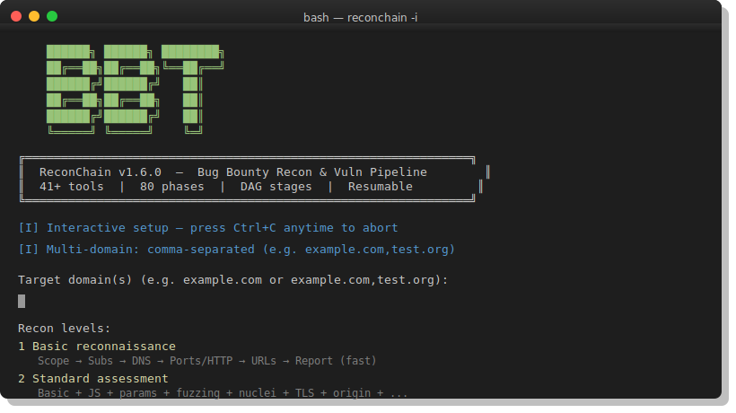

# ReconChain v2.0.0

Chains 152 recon and vulnerability phases across 27 stages into a single resumable pipeline.



```bash
reconchain -i                           # Interactive wizard
reconchain -d example.com -o ./out      # Full audit
reconchain -d example.com,test.org      # Multi-domain
reconchain -d example.com --fast        # Basic recon only
reconchain -d example.com --no-dos      # Skip DoS-style phases
```

## Install

```bash
pip install tqdm && python3 -m pip install -e '.[dev]'
chmod +x install.sh && ./install.sh
```

## Flags

| Flag | Description |
|------|-------------|
| `-d DOMAIN` | Target domain (comma-separated for multi) |
| `-o DIR` | Output directory (default: `./out/DOMAIN`) |
| `--fast` | Basic recon only (5 phases: scope, recon, resolve, scan, harvest) |
| `--only PHASES` | Comma-separated phase list, e.g. `06-JSINTEL,45-EVIDENCE` |
| `--skip PHASES` | Comma-separated phases to skip, e.g. `11-INJECT` |
| `--resume` | Resume from `state.json` |
| `--force` | Re-run all phases (ignore cache) |
| `--format FORMAT` | Report format: `html`, `md`, `json`, `sarif` |
| `--proxy URL` | SOCKS/HTTP proxy, e.g. `socks5://127.0.0.1:9050` |
| `--vuln-proxy URL` | Proxy for vuln phases only |
| `-j N` | Parallel phases (default: cpu count) |
| `--max-procs N` | Max concurrent tool subprocesses (default: half cpu count) |
| `--delay SEC` | Throttle delay between requests |
| `--rate-limit N` | Max requests/sec per tool (0 = unlimited) |
| `--dos` | Enable DoS-style phases (default) |
| `--no-dos` | Skip DoS-style phases (race bursts, password sprays, GraphQL abuse, etc.) |
| `--sqlmap-level N` | SQLMap test level 1-5 (default: 1) |
| `--sqlmap-risk N` | SQLMap risk level 1-3 (default: 1) |
| `--quiet` | Suppress banner and progress output |
| `--no-color` | Disable colored output |
| `-i` | Interactive wizard |
| `--sample` | Downsample artifacts to 1 entry per file |
| `--exclude-tags TAGS` | Comma-separated nuclei tags to exclude |
| `--header HDR` | Extra HTTP header (repeatable) |
| `--cookie STR` | Cookie string for authenticated scans |

### Low-Resource / VM Mode

For VirtualBox VMs, Docker containers, or low-RAM hosts:

```bash
reconchain -d example.com --fast -j 1 --max-procs 2 --rate-limit 5
reconchain -d example.com --fast --no-dos -j 1 --max-procs 3 --delay 0.5 --rate-limit 10
```

Every subprocess is capped at 8 GB virtual memory, 2048 child processes, and 512 MB output. A hard OS-level process counter (`--max-procs`) limits total concurrent tools across all phases.

## Phases (152)

### Recon (00–07)

00-SCOPE, 01-RECON, 02-RESOLVE, 03-PERMUTE, 04-SCAN, 04b-TAKEOVER-VALIDATE, 05-HARVEST, 05b-APISPEC, 06-JSINTEL, 07-PARAMS, 15-SECRETS

### Fuzzing (08, 21, 54)

08-FUZZ, 21-WAF, 21b-WAFBYPASS, 54-WS-FUZZ

### Vulnerability Scan (09–14, 18–20, 68, 71)

09-VULNSCAN, 10-TLSCMS, 11-INJECT, 11a-DOMXSS, 11b-SQLMAP, 12-SSTI, 13-OOB, 14-ORIGIN, 18-CLOUD, 19-GIT, 20-GRAPHQL, 68-DEPCVE, 71-EMHARVEST

### Auth / Session (16a, 16b, 17, 17b, 24, 36, 39, 40, 61, 65)

16a-AUTHZ, 16b-MASSASSIGN, 17-IDOR, 17b-SSRFMETA, 24-JWT, 36-JWTADV, 39-OAUTH, 40-PWRESET, 61-OAUTH-ADV, 65-SESSION

### Injection (22, 25–27, 42, 43, 67)

22-NOSQLI, 25-XXE, 26-CMDINJECT, 27-SSPP, 42-LDAP, 43-DESERIAL, 67-PATHNORM

### Client-Side (28, 30–35, 37, 73, 80)

28-CACHED, 30-LFI, 31-OPENREDIR, 32-CLICKJACK, 33-CRLF, 35-CORSADV, 37-FILEUPLOAD, 73-CSPBYPASS, 80-STOREXSS

### Smuggling / Race (23, 38, 38b, 41, 83)

23-RACE, 34-RATELIMIT, 38-SMUGGLE, 38b-H2SMUGGLE, 41-WEBSOCKET, 83-RACEBURST

### Infrastructure (29, 44–53, 55–60, 62–64, 66, 69–70, 72, 74–79, 81–82)

29-DEPCHECK, 44-CHAIN, 45-EVIDENCE, 46-BUCKET, 47-CDN, 48-CONTENT, 49-FRAMEWORKS, 50-BUCKET-PERMS, 51-HPP, 52-SERVERLESS, 53-CSP, 55-CSV-INJECT, 56-EXPOSED-DB, 57-DEFAULT-CREDS, 58-HOST-INJECT, 59-EMAIL-SEC, 60-SMTP-ENUM, 62-LOG-INJECT, 63-DOC-ATTACK, 64-IDEMPOTENCY, 66-SSRF-FULL, 69-DNSZT, 70-PORTFULL, 72-ACCOUNTENUM, 74-GHTOOLS, 75-MOBILEAPI, 76-WORKFLOW, 77-CACHEKEY, 78-FILEUPLOADADV, 79-SECRETDIFF, 81-IDORFUZZ, 82-OAUTHDEEP

### OSINT (84–89)

84-WHOIS, 85-ASN, 86-DORK, 87-SHODAN, 88-EMPLOYEE, 89-PASSIVEDNS

### Auth Bypass (90–99g)

90-CSRF, 91-SESSIONFIX, 92-SAML, 93-PWDSPRAY, 94-COOKIEAUDIT, 95-POSTTEST, 96-METHODOVERRIDE, 97-FORCEDBROWSE, 98-CASEBYPASS, 99-APIPAGE, 99a-TABNAB, 99b-APIKEYLEAK, 99c-REDIRABUSE, 99d-LOGTRIGGER, 99e-XSSSTORED, 99f-HOSTABUSE, 99g-AUTHBYPASSADV

### Encoding / Bypass (100–106)

100-SSI, 101-JSONINJECT, 102-NULLBYTE, 103-DOUBLEENCOD, 104-UNICODE, 105-POSTMSGXSS, 106-JSONP

### Third-Party / Headers (107–111)

107-SRI, 108-MIXEDCONTENT, 109-HSTSPRELOAD, 110-THIRDPARTYJS, 111-BROWSERSTORAGE

### Network / Infra (112–120)

112-RFI, 113-WEBDAV, 114-SNMP, 115-BANNER, 116-PHPINFO, 117-SRVSTATUS, 118-ERRORLEAK, 119-WILDCARDDNS, 120-DNSREBIND

### CMS / Framework (121–126, 131–132)

121-IISASPNET, 122-TOMCAT, 123-NODEJS, 124-LARAVEL, 125-DJANGO, 126-SYMFONY, 131-ENVDEEP, 132-GQLABUSE

### Cloud / DevOps (127–130, 133–136)

127-CICD, 128-DOCKER, 129-K8S, 130-TERRAFORM, 133-APIVERSION, 134-LBDETECT, 135-VHOST, 136-RATELIMITBYPASS

## Tools (45+)

**Go:** subfinder, amass, alterx, dnsx, naabu, httpx, nuclei, gau, gospider, katana, subjs, ffuf, dalfox, interactsh-client, kxss, gitleaks, httprobe, trufflehog, unfurl, qsreplace, Gxss, cdncheck, puredns, gowitness, cloudfox, crlfuzz, graphinder

**Python:** dnsgen, waymore, xnLinkFinder, SecretFinder, wafw00f, inql, cloud_enum, clairvoyance, arjun, jsubfinder, corsy, jwt_tool, ssmrfy, commix, wpscan, sqlmap

**System:** nmap, massdns, testssl.sh, nuclei-headless, feroxbuster (cargo)

## DoS-Sensitive Phases

The following phases are disabled by default with `--no-dos`:

20-GRAPHQL, 23-RACE, 34-RATELIMIT, 38-SMUGGLE, 38b-H2SMUGGLE, 54-WS-FUZZ, 83-RACEBURST, 93-PWDSPRAY, 132-GQLABUSE, 136-RATELIMITBYPASS

## Safety

- **Per-tool resource caps**: RLIMIT_AS (8 GB), RLIMIT_NPROC (2048), RLIMIT_FSIZE (512 MB) via `preexec_fn`
- **Global process counter**: Hard cap on total concurrent subprocesses (`--max-procs`)
- **Memory monitoring**: Warns when available RAM drops below 1 GB
- **Rate limiting**: Per-tool rate limits via `--rate-limit` and `--delay`

## Output

```
out/example.com/
├── summary.json / summary.txt / report.html / report.md / results.sarif
├── hosts.txt urls_all.txt nuclei_combined.txt
├── evidence/             # Auto-generated PoCs
├── screenshots/          # Gowitness browser screenshots
├── logs/                 # Raw tool output
└── state.json            # Resume state
```

## License

MIT
